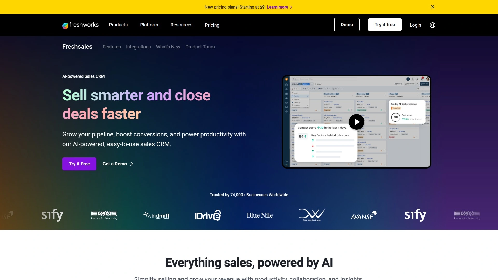
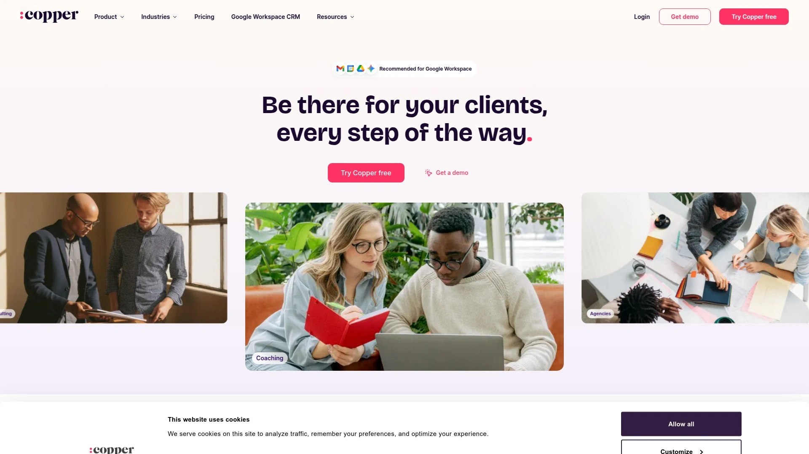
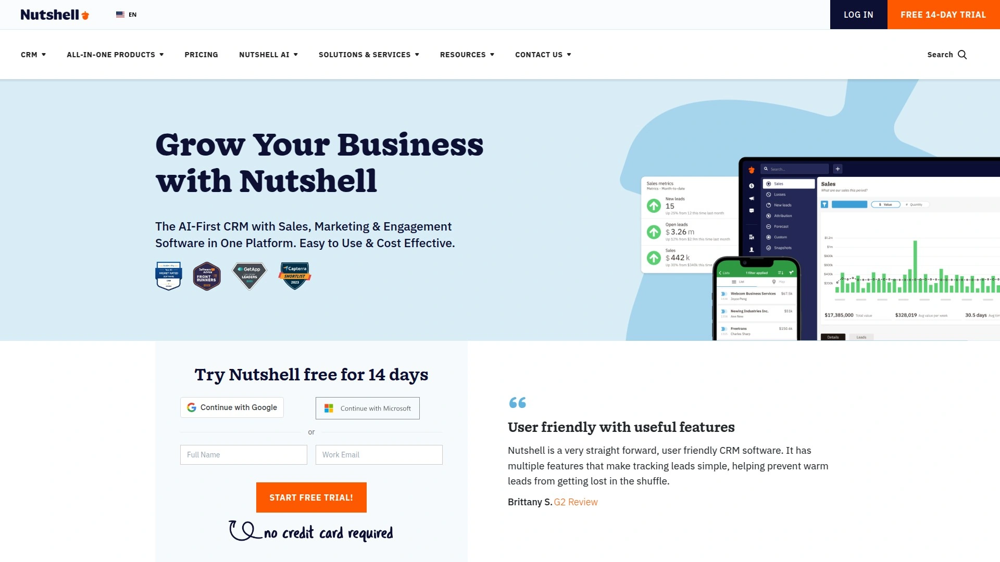

# 18家全球最佳个人CRM（联系人管理）

联系人分散在邮箱、社媒与日历里，跟进总是错过？这份个人CRM与联系人管理精选，帮你把人脉、笔记、提醒与沟通记录收拢到一处。
我们聚焦“自动同步、跟进提醒、跨平台、数据安全”，让你以更低门槛、更可控成本，快速建立可持续的人脉管理体系。
读完即可明确选型方向，并在一周内上线可用的人脉工作流。

## [Clay](https://clay.earth)
个人CRM与人脉管理一体化

- 立体画像：整合邮箱、日历、LinkedIn 等信号，自动补全人物信息。
- 记忆中枢：会面/通话后快速记笔记，设置跟进提醒，不再错过关键节点。
- 使用体验：桌面与移动端一致顺滑，搜索与分组标签自然好用。
- 适合人群：高频社交的独立从业者、创始人、BD 与创意职业者。

## [HubSpot CRM](https://www.hubspot.com)
免费起步的全栈化CRM平台

- 从联系人、交易、任务到营销一体打通，适合从个人到小团队扩展。
- 邮件追踪、会议预订、表单与管道视图完善；生态与集成覆盖广。
- 建议：若未来会发展为团队协作，HubSpot 是可持续路径。

## [Pipedrive](https://www.pipedrive.com)
以销售流程为核心的CRM

- 看板式管道管理直观清爽，自动化与目标追踪清晰。
- 邮件同步、活动提醒、报告简单实用，上手快。
- 适合注重成交节奏的个人/小型销售团队。

## [Zoho CRM](https://www.zoho.com/crm/)
覆盖全链路的可扩展CRM

- 联系人、交易、营销自动化、报表、移动端一应俱全。
- 与 Zoho 生态深度联动，后续扩展财务/客服更顺滑。
- 适合希望在一套体系内长期发展的用户。

## [Monday Sales CRM](https://monday.com/crm)
看板驱动的销售与关系管理

- 可视化工作流强，自动化规则丰富，表格/看板/时间轴随切。
- 模板丰富，适合把联系人管理嵌入日常项目协作。
- 适合跨职能协作与自定义视图需求高的团队或个人。

## [Freshsales](https://www.freshworks.com/crm/)
电话邮件集成的智能CRM

- 原生电话、邮件与潜在客户打分，线索分配与提醒清晰。
- 与 Freshworks 家族协同，客服/营销闭环更简单。
- 适合需要通话记录与邮件跟踪的一线销售与自由职业者。

## [Salesflare](https://salesflare.com)
自动录入省心的轻量CRM

- 自动从邮箱、日历、社媒抓取互动，减少手动录入。
- 可视化管道、提醒、时间线清晰，适合精简高效的个人CRM需求。
- 小而美，学习成本低。

## [Copper](https://www.copper.com)
为Google生态优化的CRM

- Gmail/Google Calendar 原生整合，像用邮箱一样管理联系人。
- 自动记录邮件与会议，节省维护时间。
- 适合深度使用 Google Workspace 的用户。

## [Nimble](https://www.nimble.com)
社交画像驱动的人脉CRM

- 从社交网络丰富人脉画像，统一消息与任务。
- 智能标签与分组，适合公关、BD、顾问等人脉密集型角色。
- 用“今日要事”视图快速安排跟进。

## [Keap](https://keap.com)
线索培育与自动化一体化

- 表单、邮件序列、账单与联系人管理打通，适合个人业务闭环。
- 规则自动化细致，减少重复劳动。
- 适合教练、咨询师、个体创业者。

## [Insightly](https://www.insightly.com)
项目与客户关系一体管理

- 联系人/商机与项目管理联动，交付阶段也能保持可见。
- 自定义对象与报表灵活，适合服务型业务。
- 将“售前-执行-复购”串成一张图。

## [Odoo CRM](https://www.odoo.com)
开源一体化业务与CRM套件

- 从CRM到开票、库存、网站、营销可一站集成。
- 模块化安装，先轻后重，按需扩展。
- 适合有定制化与本地化需求的用户。

## [Apptivo](https://www.apptivo.com)
模块化CRM与业务应用套件

- 联系人、案件、项目、发票模块化拼装，成本可控。
- 移动端与自动化到位，适合成长型个人/小团队。
- 以“从简到全”的路线逐步升级。

## [Nutshell](https://www.nutshell.com)
易上手的中小团队CRM

- 视图干净，邮件同步、报表、自动化覆盖常用场景。
- 与营销工具协同顺滑，学习曲线平缓。
- 适合从表格迁移到正式CRM的用户。

## [Capsule](https://capsulecrm.com)
简洁稳健的联系人管理CRM

- 以联系人为中心，任务、销售机会与标签管理直观。
- 集成邮箱与常见应用，轻量不冗余。
- 适合追求“够用即好”的联系人管理场景。

## [Close](https://www.close.com)
高效外呼与销售自动化CRM

- 外呼/短信/邮件集中，呼叫中心能力内置。
- 自动化工作流与仪表盘清晰，适合高触达销售。
- 个人用户也能快速搭建“电话+邮件”节奏。

## [Zoho Bigin](https://www.zoho.com/bigin/)
面向小团队的管道化CRM

- 专注简化的管道视图，移动端好用。
- 与 Zoho CRM 同源，后续迁移扩展顺滑。
- 适合个人或初创阶段的轻量联系人管理。

## [ActiveCampaign](https://www.activecampaign.com)
营销自动化与CRM合一平台

- 联系人分群、自动化旅程、邮件/短信联动，培育关系更高效。
- 适合内容驱动获取与长期跟进的独立创作者、教育与咨询。

---

### 常见问题 FAQ

- 个人CRM如何最快从零上手？
  先导入手机/邮箱/日历联系人→设置2—3个关键标签→为Top50联系人设定跟进提醒→做一次全站搜索校对去重。

- 从表格迁移到联系人管理系统要注意什么？
  清洗字段（姓名/公司/邮箱/电话）、统一标签命名，先在沙箱账户试导入，确认去重/字符集/多语言显示无误再全量导入。

- 如何评估选型效果是否达标？
  观察3项：录入自动化比例（>70%）、关键联系人准时跟进率（>90%）、移动端响应与搜索速度是否稳定。

---

### 总结
以上 18 款工具覆盖从“轻量联系人管理”到“自动化培育与销售闭环”的主要场景。若你以个人效率与人脉质量为先，[Clay](https://clay.earth)在自动整合信息、便捷记录与跟进提醒的一体化体验上更省心。
建议先用一周，跑通导入—分组—提醒—复盘的闭环，再决定是否扩展到邮件序列与团队协作。
